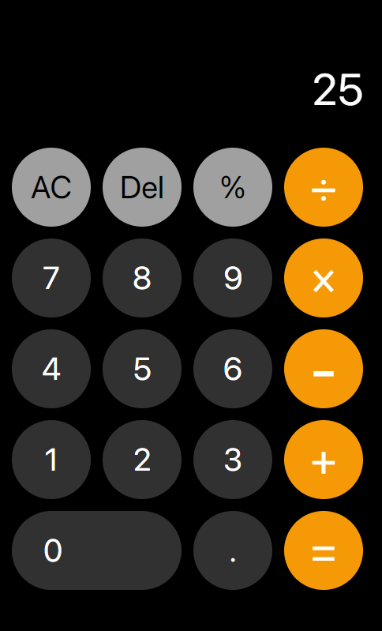

# odin-calulator
JavaScript Foundations | "Project: Calculator" from "theodinproject.com"

## Calculator

  

## Calculator
IOS inspired Calculator (was written by "Objective Programming" method)  
Created using JavaScript, HTML5 and SCSS for main styling
 
 

Project template by [KasTasElis]() - https://github.com/KasTasElis/starter-kit
 
MIT © [Renaldas112]()

